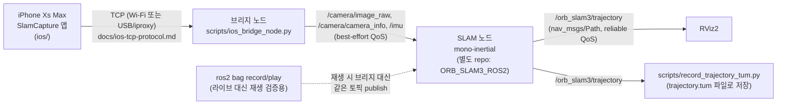

# slam-tx2

> English version [here](README.md).

iPhone 카메라+IMU → Jetson TX2 → ORB-SLAM3(mono-inertial) → RViz2. 용어는 [CONTEXT.md](CONTEXT.ko.md),
현재 상태/다음 할 일은 [docs/handoff.md](docs/handoff.ko.md) 참고. 이 문서는 **라이브 세션을 RViz2로
보는 절차 하나만**, 노드/스크립트 연결 관계와 함께 재현 가능하게 정리한 것이다.

## 노드/토픽 연결 관계



- 토픽 이름/타입/QoS 계약: [docs/ros2-topic-contract.md](docs/ros2-topic-contract.ko.md)
- 브리지 노드 상세: [docs/bridge-node.md](docs/bridge-node.ko.md)
- iPhone↔TX2 와이어 프로토콜: [docs/ios-tcp-protocol.md](docs/ios-tcp-protocol.ko.md)
- SLAM 노드(mono-inertial) C++ 소스는 이 저장소가 아니라 별도 repo
  `aisys-max/ORB_SLAM3_ROS2`에 있다 (클론 위치 `/mnt/ssd/ros2_foxy/src/slam-tx2/orbslam3`,
  main 직커밋 워크플로 — `docs/handoff.md` 참고).

## 이 저장소의 스크립트 (`scripts/`)

| 스크립트 | 역할 |
|---|---|
| [`ios_bridge_node.py`](scripts/ios_bridge_node.py) | iPhone TCP 스트림을 프로젝트 표준 센서 토픽으로 publish (브리지 노드) |
| [`record_trajectory_tum.py`](scripts/record_trajectory_tum.py) | `/orb_slam3/trajectory`를 실시간으로 TUM 파일에 흘려 저장 — 맵 리셋으로 프로세스가 죽어도 유실 없음 |
| [`analyze_tum_quality.py`](scripts/analyze_tum_quality.py) | TUM 궤적 파일에서 리셋/발행 gap/순간 점프 검출 ([#15](https://github.com/aisys-max/slam-tx2/issues/15)) |
| [`evaluate_ate.py`](scripts/evaluate_ate.py) | 두 TUM 궤적 사이 ATE(정합 후 RMSE) 계산 — 라이브 vs 재생 동등성 검증([#7](https://github.com/aisys-max/slam-tx2/issues/7)) 등에 사용 |
| [`capture_imu_pose.py`](scripts/capture_imu_pose.py) | 정지 자세에서 `/imu` 가속도/자이로 평균 캡처 — Tbc 추정용 ([#15](https://github.com/aisys-max/slam-tx2/issues/15)) |
| [`estimate_tbc_rotation.py`](scripts/estimate_tbc_rotation.py) | 정지 자세 3개(카메라 아래/위/수평)의 중력 벡터로 카메라-IMU 회전(Tbc) 추정 |
| [`compute_allan_variance.py`](scripts/compute_allan_variance.py) | 정지 상태로 장시간 기록한 `/imu` bag으로 Allan variance 계산 → IMU 노이즈 파라미터 |
| [`calibrate_camera.py`](scripts/calibrate_camera.py), [`capture_calibration_images.py`](scripts/capture_calibration_images.py) | 체커보드로 카메라 내부 파라미터 캘리브레이션 ([docs/camera-calibration.md](docs/camera-calibration.ko.md)) |
| [`euroc_to_rosbag2.py`](scripts/euroc_to_rosbag2.py) | EuRoC 데이터셋을 프로젝트 표준 토픽 bag으로 변환 (오프라인 SLAM 노드 검증용) |
| [`ios_bridge_node.py`](scripts/ios_bridge_node.py)와 짝인 `test_ios_bridge_node.py`, `test_ios_tcp_client.py` | 브리지 노드/와이어 프로토콜 유닛 테스트 |

## RViz2로 라이브 궤적 보기 (재현 절차)

### 0. 사전 준비

- iPhone에서 `SlamCapture` 앱 실행 (Wi-Fi 직결 권장 — USB/iproxy보다 빠름. iPhone 설정 → Wi-Fi
  → 연결된 네트워크 (i) 아이콘에서 IP 확인). 앱은 버튼 없이 `onAppear`에서 자동으로 캡처를
  시작한다 ([ios/SlamCapture/ContentView.swift](ios/SlamCapture/ContentView.swift)).
- TX2에서 ROS2 소스 (매번 이렇게 잡을 것 — `COLCON_TRACE` unbound-variable 이슈 때문):
  ```bash
  set +u; source /mnt/ssd/ros2_foxy/install/setup.bash; set -u
  ```
- RViz2는 물리 모니터에서 실행할 것 (X11 forwarding은 TX2/NVIDIA-Tegra GLX 드라이버가 indirect
  rendering을 지원 안 해서 실패함):
  ```bash
  ros2 run rviz2 rviz2
  ```
  Fixed Frame을 `map`으로 설정하고, Add → By topic → `/orb_slam3/trajectory` → Path.
  **Displays 패널에 Path 항목이 보여도 실제 구독이 안 될 수 있다** — 안 그려지면 아래 "확인"
  절 참고.

### 1. 브리지 노드

```bash
python3 scripts/ios_bridge_node.py <iPhone IP> 8765
```
`연결됨` 로그가 뜨는지 확인. (여기서 연결됐다고 해서 센서 데이터가 바로 흐르는 건 아니다 —
2번 SLAM 노드까지 띄운 뒤 `ros2 topic hz`로 최종 확인할 것.)

### 2. SLAM 노드 (새 디렉터리에서, 어휘 로딩에 시간 걸림)

```bash
mkdir -p /mnt/ssd/live_e2e/<세션 이름> && cd /mnt/ssd/live_e2e/<세션 이름>
ros2 run orbslam3 mono-inertial \
  /mnt/ssd/orb_slam3_stack/ORB_SLAM3/Vocabulary/ORBvoc.txt \
  /mnt/ssd/ros2_foxy/src/slam-tx2/orbslam3/config/monocular-inertial/iPhoneXsMax.yaml
```
`There are 1 cameras in the atlas` 로그가 뜨면 준비 완료.

### 3. 궤적 recorder (선택 — 나중에 정량 분석하려면 필요)

```bash
python3 scripts/record_trajectory_tum.py /mnt/ssd/live_e2e/<세션 이름>/trajectory.tum
```

### 4. 확인

```bash
ros2 topic info /orb_slam3/trajectory --verbose   # Subscription count에 rviz 노드가 있는지 확인
```
없으면 RViz Displays 패널에서 Path 항목을 지웠다가 다시 Add.

### 5. 걷기

iPhone을 들고 **평행 이동 위주로, 제자리 회전 없이** 천천히 걷는다 (사각형 한 바퀴, 복도 왕복
등). 제자리 회전/패닝은 단안 SLAM 최악의 입력이라 초기화가 안 된다.

맵이 리셋되면 SLAM 노드 로그에 `Map (re)initialized - clearing published trajectory...`가
찍히고 RViz의 Path가 (좌표계가 바뀌었으므로) 비워지고 새로 시작한다 — 의도된 동작이다
([#15](https://github.com/aisys-max/slam-tx2/issues/15)). 리셋이 너무 잦으면
[#10](https://github.com/aisys-max/slam-tx2/issues/10)(프레임레이트 격차, TX2에서 실측
~5.8Hz vs 목표 20Hz) 영향일 가능성이 크다.

### 정리 순서

recorder → SLAM 노드 → 브리지 노드 순서로 Ctrl+C (또는 `kill`).

## 더 자세히

- [docs/handoff.md](docs/handoff.ko.md) — 현재 상태, 다음에 할 만한 일, 자주 막히는 지점 전체 목록
- [docs/live-e2e-validation.md](docs/live-e2e-validation.ko.md) — 라이브/재생 동등성 검증 전체 기록 ([#7](https://github.com/aisys-max/slam-tx2/issues/7))
- [docs/adr/](docs/adr/) — 설계 결정 (타임스탬프 기준, ROS2 Foxy 채택, 어댑터 레이어 미채택 등)
