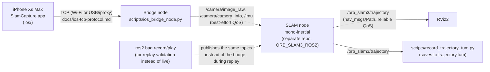

# slam-tx2

> 한국어 버전은 [여기](README.ko.md)에 있습니다.

iPhone camera+IMU → Jetson TX2 → ORB-SLAM3 (mono-inertial) → RViz2. Terms are in
[CONTEXT.md](CONTEXT.md), current status/next steps in [docs/handoff.md](docs/handoff.md). This
doc covers **just one thing — watching a live session in RViz2** — laid out reproducibly along
with how the nodes/scripts connect.

## Node/topic wiring



- Topic name/type/QoS contract: [docs/ros2-topic-contract.md](docs/ros2-topic-contract.md)
- Bridge node details: [docs/bridge-node.md](docs/bridge-node.md)
- iPhone↔TX2 wire protocol: [docs/ios-tcp-protocol.md](docs/ios-tcp-protocol.md)
- The SLAM node's (mono-inertial) C++ source isn't in this repo — it's in a separate repo,
  `aisys-max/ORB_SLAM3_ROS2` (cloned at `/mnt/ssd/ros2_foxy/src/slam-tx2/orbslam3`, a
  direct-commit-to-main workflow — see `docs/handoff.md`).

## This repo's scripts (`scripts/`)

| Script | Role |
|---|---|
| [`ios_bridge_node.py`](scripts/ios_bridge_node.py) | Publishes the iPhone TCP stream as the project's standard sensor topics (bridge node) |
| [`record_trajectory_tum.py`](scripts/record_trajectory_tum.py) | Streams `/orb_slam3/trajectory` to a TUM file in real time — nothing is lost even if the process dies from a map reset |
| [`analyze_tum_quality.py`](scripts/analyze_tum_quality.py) | Detects resets/publish gaps/instantaneous jumps in a TUM trajectory file ([#15](https://github.com/aisys-max/slam-tx2/issues/15)) |
| [`evaluate_ate.py`](scripts/evaluate_ate.py) | Computes ATE (RMSE after alignment) between two TUM trajectories — used for live vs. replay equivalence validation ([#7](https://github.com/aisys-max/slam-tx2/issues/7)), etc. |
| [`capture_imu_pose.py`](scripts/capture_imu_pose.py) | Captures `/imu` accel/gyro averages at a static pose — for Tbc estimation ([#15](https://github.com/aisys-max/slam-tx2/issues/15)) |
| [`estimate_tbc_rotation.py`](scripts/estimate_tbc_rotation.py) | Estimates the camera-IMU rotation (Tbc) from the gravity vector at 3 static poses (camera down/up/horizontal) |
| [`compute_allan_variance.py`](scripts/compute_allan_variance.py) | Computes Allan variance from a long stationary `/imu` bag recording → IMU noise parameters |
| [`calibrate_camera.py`](scripts/calibrate_camera.py), [`capture_calibration_images.py`](scripts/capture_calibration_images.py) | Camera intrinsic calibration via checkerboard ([docs/camera-calibration.md](docs/camera-calibration.md)) |
| [`euroc_to_rosbag2.py`](scripts/euroc_to_rosbag2.py) | Converts the EuRoC dataset into a bag with the project's standard topics (for offline SLAM node validation) |
| `test_ios_bridge_node.py`, `test_ios_tcp_client.py`, paired with [`ios_bridge_node.py`](scripts/ios_bridge_node.py) | Unit tests for the bridge node/wire protocol |

## Watching a live trajectory in RViz2 (reproduction procedure)

### 0. Prerequisites

- Run the `SlamCapture` app on the iPhone (Wi-Fi direct recommended — faster than USB/iproxy.
  Find the IP under iPhone Settings → Wi-Fi → connected network → the (i) icon). Camera/IMU
  hardware and the TCP listener start automatically in `onAppear`, but nothing is sent to the TX2
  until you tap **Start** — tap **Stop** when the run is done, so pre/post-test idle data doesn't
  pollute the capture ([ios/SlamCapture/ContentView.swift](ios/SlamCapture/ContentView.swift)).
- Source ROS2 on the TX2 (do it this way every time — because of the `COLCON_TRACE`
  unbound-variable issue):
  ```bash
  set +u; source /mnt/ssd/ros2_foxy/install/setup.bash; set -u
  ```
- Run RViz2 on the physical monitor (X11 forwarding fails since the TX2/NVIDIA-Tegra GLX driver
  doesn't support indirect rendering):
  ```bash
  ros2 run rviz2 rviz2
  ```
  Set Fixed Frame to `map`, and Add → By topic → `/orb_slam3/trajectory` → Path.
  **The Path item can appear in the Displays panel without an actual subscription** — if nothing
  draws, see the "Verify" step below.

### 1. Bridge node

```bash
python3 scripts/ios_bridge_node.py <iPhone IP> 8765
```
Confirm the `Connected` log appears. (Connecting here doesn't mean sensor data is flowing yet —
confirm with `ros2 topic hz` once the SLAM node from step 2 is also up.)

### 2. SLAM node (in a fresh directory, vocabulary loading takes a while)

```bash
mkdir -p /mnt/ssd/live_e2e/<session name> && cd /mnt/ssd/live_e2e/<session name>
ros2 run orbslam3 mono-inertial \
  /mnt/ssd/orb_slam3_stack/ORB_SLAM3/Vocabulary/ORBvoc.txt \
  /mnt/ssd/ros2_foxy/src/slam-tx2/orbslam3/config/monocular-inertial/iPhoneXsMax.yaml
```
Ready once you see the `There are 1 cameras in the atlas` log.

### 3. Trajectory recorder (optional — needed if you want to analyze it quantitatively later)

```bash
python3 scripts/record_trajectory_tum.py /mnt/ssd/live_e2e/<session name>/trajectory.tum
```

### 4. Verify

```bash
ros2 topic info /orb_slam3/trajectory --verbose   # confirm the rviz node is in Subscription count
```
If not, remove the Path item in the RViz Displays panel and Add it again.

### 5. Walk

Hold the iPhone and walk slowly, **mostly translating, without spinning in place** (a loop
around a square, back and forth down a hallway, etc.). Pure rotation/panning is the worst input
for monocular SLAM and won't initialize.

When the map resets, the SLAM node log prints
`Map (re)initialized - clearing published trajectory...` and RViz's Path is cleared (since the
coordinate frame changed) and starts fresh — this is intended behavior
([#15](https://github.com/aisys-max/slam-tx2/issues/15)). If resets happen too often, it's
likely the effect of [#10](https://github.com/aisys-max/slam-tx2/issues/10) (a frame-rate gap —
measured ~5.8Hz on the TX2 vs. a 20Hz target).

### Shutdown order

Ctrl+C (or `kill`) the recorder → SLAM node → bridge node, in that order.

## Learn more

- [docs/handoff.md](docs/handoff.md) — current status, what's worth doing next, the full list of
  common sticking points
- [docs/live-e2e-validation.md](docs/live-e2e-validation.md) — full record of live/replay
  equivalence validation ([#7](https://github.com/aisys-max/slam-tx2/issues/7))
- [docs/adr/](docs/adr/) — design decisions (timestamp basis, adopting ROS2 Foxy, no adapter
  layer, etc.)
